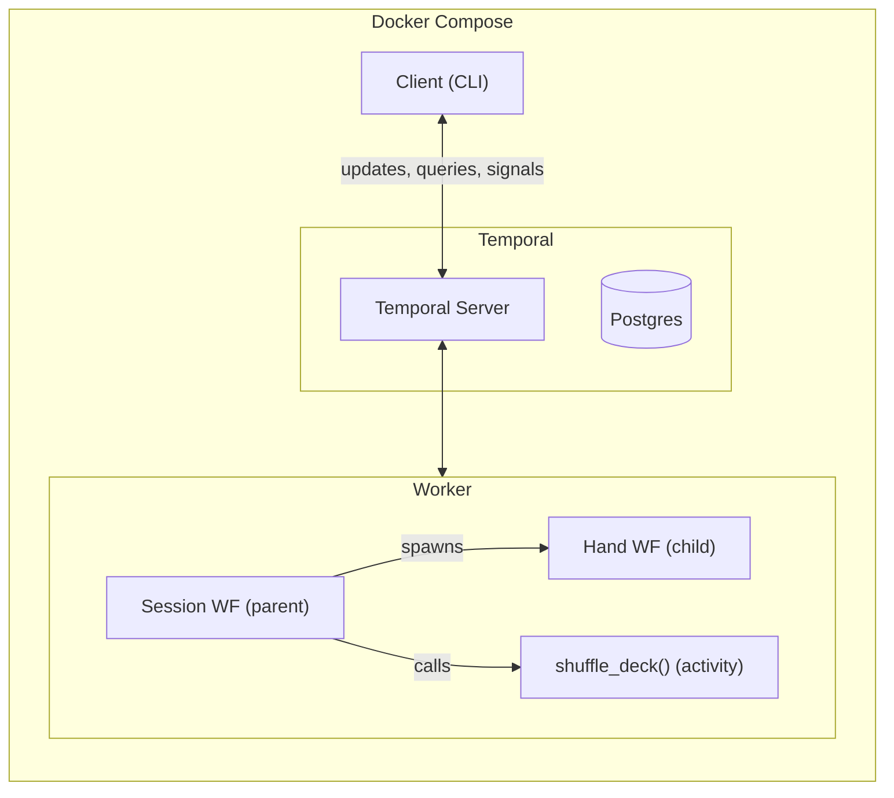
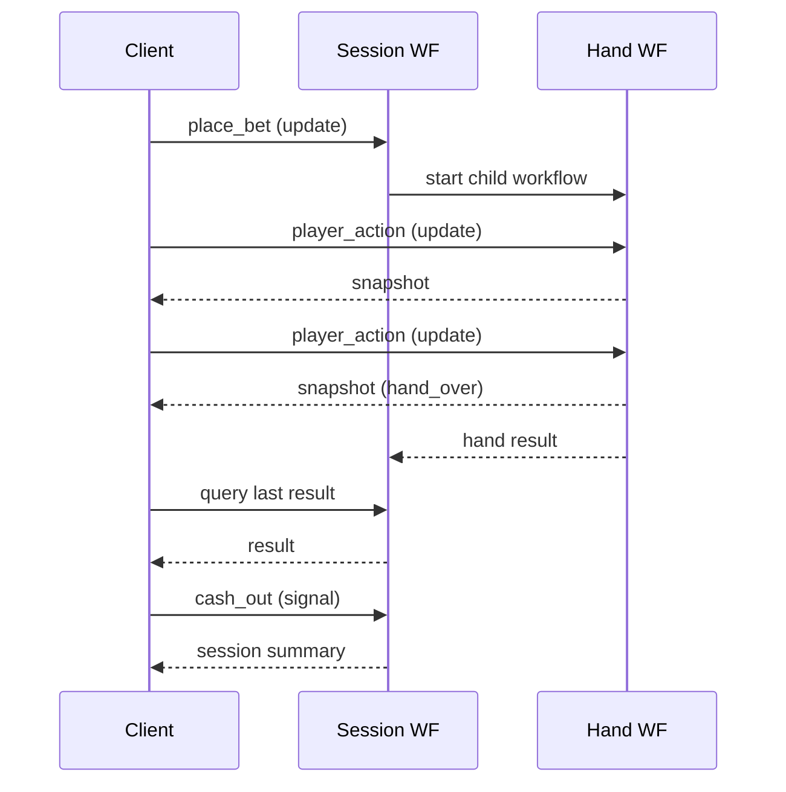

# Blackjack Casino

A fully Dockerized Blackjack game powered by [Temporal.io](https://temporal.io) workflows.

## Architecture





- **Parent workflow** (`BlackjackSessionWorkflow`) - Manages bankroll, 6-deck shoe, and session stats. Spawns one child workflow per hand.
- **Child workflow** (`BlackjackHandWorkflow`) - Handles a single hand: player actions (hit/stand/double/split) via Temporal update handlers, then runs dealer AI.
- **Activity** (`shuffle_deck`) - Shuffles a 6-deck (312 card) shoe.

## Run

```bash
docker compose up -d
docker compose --profile play run --rm client
```

## Game Rules

- 6-deck shoe, reshuffled when low
- Blackjack pays 3:2
- Dealer stands on 17
- Split and double down supported
- $1000 starting bankroll, $10 minimum bet

## Stack

- Python, Temporal Python SDK
- Postgres (Temporal persistence)
- Docker Compose
